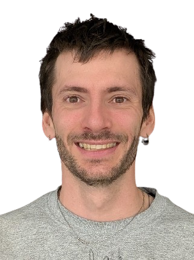
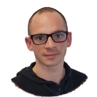

<!-- # MetaDatApp -->

## Your All-in-one Metadata Management Platform

Elevate Your Preclinical Research with Metadatapp (MAPP): Our platform helps you to **Streamline** your metadata management, enhance **transparency**, and ensure your research practices align with the **highest ethical standards** and the **FAIR framework**.

<!-- 
[What is Metadatapp ?](#what-is-metadatapp)
  

  <a href="#what-is-metadatapp">Learn more about Metadatapp ?</a>

   -->

  <a href="#what-is-metadatapp" class="btn btn--mapp-primary">Learn more about Metadatapp</a>
  <a href="#the-team" class="btn">Who are we?</a>
  <a href="#mapp-is-fair-by-design" class="btn btn--mapp-accent">MAPP is FAIR (by design)</a>

---

<h2 id="what-is-metadatapp">What is MetaDatApp?</h2>
{: .block}

**MetaDatApp** is a platform designed to streamline metadata management for preclinical research. Our solution ensures compliance with **FAIR principles**, seamlessly integrates with laboratory tools such as **LIMS**, colony manager and electronic lab notebooks, and enhances reproducibility by meticulously tracking and recording all relevant experimental data.

Our goal is to empower researchers with tools to simplify research workflows, ensure FAIR compliance, and enhance reproducibility in science. Together, we make research more efficient and impactful.

  <a href="https://en.wikipedia.org/wiki/Metadata" class="btn">What is metadata?</a>

 

  <a href="#discover-how-metadatapp-transforms-metadata-management" class="btn btn--mapp-primary">Learn More about MetaDatApp</a>

 

---

<h2 id="mapp-is-fair-by-design">MAPP is FAIR-by-design!</h2>
{: .block}
MAPP isn’t merely “compatible” with FAIR; it was engineered around these principles:
- API-first + JSON-LD give universal findability and interoperability.
- Open protocols + OIDC ensure controlled but straightforward accessibility.
- Rich domain schema + provenance hooks drive long-term reusability.
=> FAIR compliance is baked into the MAPP architecture (not bolted on afterwards), making your (meta)data FAIR-by-design !

---

<h2 id="discover-how-metadatapp-transforms-metadata-management">Discover How MetaDatApp Transforms Metadata Management</h2>
{: .block}

### Science-Crafted Management
- FAIR-by-design
- Developed by **scientists for scientists**.
- Intuitive database system **eliminating redundant data entry**.
- **Time Efficiency:** focus on your research we do the rest!
- **Seamless Integration:** Connects with all your third-party lab applications.

### Flexible and Integrated
- **Your question**, our solution: No need to be data-specialist to make your data FAIR!
- **Automated:** Capture metadata entries without manual effort.
- **Standards Compliance:** Adheres to FAIR principles, fill the ARRIVE guidelines, ...
- **Easy Export:** Export logs for audits, reviews, or scientific publications.

### Single Data Entry
- Save time with a streamlined data entry process.
- Reduce errors and improve efficiency.
- Enter your data once, it'll be saved and linked with your experiments forever!

### Flexible Export Formats
- Export your data in **CSV, JSON, and other formats** for easy sharing.
- FAIR compliance
- extendable to other formats (.NWB, ...)

### Enhanced Transparency and Replicability
- Improve research visibility and ensure **ethical research practices**.
- **Facilitate Accurate Interpretation:** Simplify data analysis.
- Respects the 3Rs and improves animal welfare

### Promote Collaboration
- **Secure Data Sharing:** Enable safe data exchange within teams.
- **Access Control:** Manage permissions effectively.
- **Foster Interdisciplinary Cooperation:** Enhance teamwork across fields.

---

<h2 id="the-team">The Team</h2>
{: .block}

    

        
    

    

        <a href="https://neuronautix.com" class="btn btn--mapp-primary">NeuroNautix</a>
         
         
        <a href="https://dhuzard.github.io" class="btn" style="margin-bottom: 10px;">Personal Website</a> 
         
         
        <a href="https://www.linkedin.com/in/dhuzard/" class="btn">LinkedIn Profile</a>
    

### **Damien Huzard, PhD** - Founder (& CSO)
With 15 years of experience in **preclinical academic research** and specializing in **behavioral neuroscience** and **data analysis**, Damien transitioned to making an impact on science from an external perspective. His involvement in the behavioral community and his interest in creating customized solutions inspired him to create [NeuroNautix](www.neuronautix.com) to share his behavioral expertise and MetaDatApp to improve metadata management in research. Additionally, he serves as an administrator, moderator and voice of [The Behaviour Forum](www.thebehaviourforum.org).

---

    

        
    

    

        <a href="https://www.linkedin.com/in/laurent-huzard-84569939/" class="btn btn--mapp-primary">LinkedIn</a>
    

### **Laurent Huzard** - Open Source Backbone
Laurent is our open‑source contributor specializing in PHP (Symfony & API Platform). He’s the go‑to debugger in our community, meticulously reviewing pull requests, hardening code architecture and crafting reusable modules. His structured, framework‑driven approach keeps our projects solid, performant and scalable—driving adoption and helping fellow developers build with confidence.
---

    

        
    

    

        <a href="mailto:damien.huzard@gmail.com" class="btn btn--mapp-accent">📧 Contact Damien 📧</a>
    

### **You ?!** - Co-founder / CTO
I'm currently looking for a co-founder (CTO) to join the adventure! 
Do you have:
- a technical background (extensive knowledge in Symfony is required!).
- some startup experience in SaaS
- Appetance for better science 
- Curiosity for semantic web and data standards
Then, Drop me an email and let's chat !

---

## The Board of Advisors and Experts
{: .block}

###   
**Prof. Carmen Sandi, PhD**  
*Advisor – Neuroscience & Stress Research | Professor @ EPFL-LGC*  
[🔗 EPFL Profile](https://people.epfl.ch/carmen.sandi?lang=en) | [📚 Wikipedia](https://en.wikipedia.org/wiki/Carmen_Sandi)

Carmen is a world-renowned neuroscientist and professor at EPFL, where she leads the Laboratory of Behavioral Genetics. Her research focuses on the neurobiology of stress, cognition, and social behaviors, with 190+ publications and over 12,600 citations. A former president of FENS and EBBS, Carmen has pioneered insights into social dominance, coping mechanisms, and psychiatric vulnerability. She is also a founder of the Swiss Stress Network and a leading voice in translational neuroscience.

###   
**Thibault Géoui, PhD**  
*Advisor – AI for Drug Discovery | Founder @ Venabili Labs*  
[🔗 LinkedIn](https://www.linkedin.com/in/thibaultgeoui/)

Thibault is a biotech innovation leader with 20+ years of experience bridging science, data, and AI. Former Head of Science Analytics at Charles River and product strategy lead at QIAGEN and Elsevier, he’s launched 30+ tools transforming R&D. Now founder of Venabili Labs, he helps life sciences companies integrate AI for faster, smarter drug development. Ranked in LinkedIn’s Top 1% in Pharma, Thibault also hosts the *Tech and Drugs* podcast spotlighting the future of AI in biotech.

### 
**Serge Sonfack, PhD**
*Web Semantics, knowledge graphs and Ontologies*

Serge SONFACK is a free and open-source advocate and an AI researcher in knowledge representation (Uncertainty, Logic, Graph, Semantic Web) and reasoning. His current research topics are Activity Knowledge Management (AKM), Human-Machine Collaborative Intelligence, and Dynamic Knowledge Graphs (DKG).
Serge and Damien already collaborated on the [Mouse Behavior Ontology](https://osf.io/s8kr9/). 

  

          <a href="https://www.linkedin.com/in/serge-sonfack-29873250/" class="btn btn--mapp-primary">LinkedIn</a>
  

   
  

          <a href="https://orcid.org/0000-0002-6085-6818/" class="btn btn--mapp-primary">ORCID</a>
  

---
## Our Academic Partners
{: .block}

### **Coming soon**
We are actively working on finding the perfect academic partner in order to propel our ideas into something truly unique! bringing new knowledge to our scientific community!

---

## Our external supports and collaborators
{: .block}

This project would not be possible without the tremendous and generous help from passionated and kind individuals which helped frame and initiate this adventure in the correct path!
<!-- Nico Carpi
Esther NC3R
Anastassia FC3R
Kelly Softmouse -->
---

## Q & A
{: .block}

**Q: Do I have to enter all my animal data twice, in the LIMS and in MetaDatApp?**  
**A:** No! MAPP eliminates redundant data entry by integrating with your favorite laboratory apps.

**Q: How does MetaDatApp improve transparency and ethics in research?**  
**A:** By recording all life events of subjects until publication, ensuring **scientific transparency** and **ethical research**.

**Q: Can I export my data to link with scientific articles?**  
**A:** Yes! Metadatapp allows **CSV, JSON, JSON-LD (and soon NWB) format exports** , making it easy to link datasets to publications. Importantly, you can directly link your metadata set into an OSF repository for example.

**Q: What standards does MetaDatApp support?**  
**A:** MetaDatApp adheres to **FAIR principles**, supports the **NWB format**, and follows **RDA guidelines** and **Open Science initiatives**. We are compliant with ontologies and are following web semantic strategies.

---

## Contact Us
{: .block}

**Have questions or want a demo?** Get in touch today!

  <a href="mailto:contact@metadatapp.net" class="btn btn--mapp-accent">📧 Email Us Now </a>

 

---

© 2025 MetaDatApp. All rights reserved. Licensed under the GNU Affero General Public License.

[Privacy Policy](#) | [Terms of Service](#)
